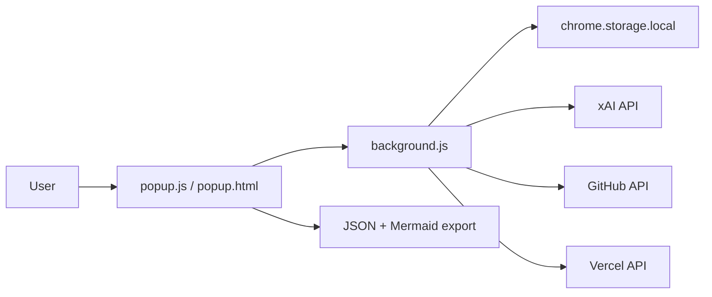

Use this skill when reviewing pull requests in this repository.

## 1) Start with a repo map

```text
agentic-chrome-extension-slingshot/
├── strategy docs (01-05 markdown files)
└── extension/
    ├── manifest.json
    ├── background.js
    ├── popup.html
    ├── popup.css
    ├── popup.js
    └── README.md
```



## 2) Review critical components first

1. `extension/manifest.json`
   - permissions and host permissions are least-privilege and justified.
2. `extension/background.js`
   - API requests, token handling, and message routing are safe.
3. `extension/popup.js`
   - user input handling, diagram updates, and export behavior are stable.

## 3) Use this checklist in every review

- [ ] Confirm issue requirements are fully covered
- [ ] Verify no unrelated files are changed
- [ ] Check security-sensitive flows (tokens, network requests, storage)
- [ ] Validate user-visible behavior with manual popup flow where possible
- [ ] Confirm docs/readme updates when behavior changes
- [ ] Summarize risks, follow-ups, and confidence level

## 4) Agent / tool / workflow expectations

- Use GitHub tools to inspect PR diffs, reviews, checks, and issues.
- If CI/build/test/workflow problems are mentioned:
  1. list workflow runs
  2. inspect failed/cancelled jobs and logs
- Keep feedback high signal: correctness, security, and regressions first.
