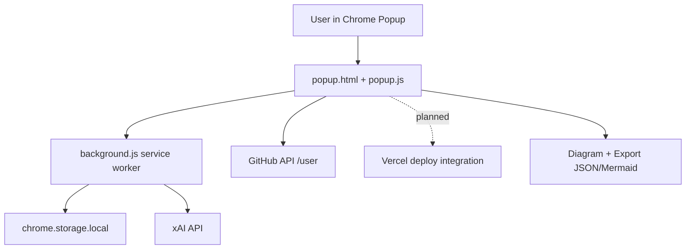

# Agentic Chrome Extension — Slingshot Package

Complete strategy + code package for building a conversational AI Chrome extension that turns natural language into deployable multi-agent systems.

**Live Repo:** https://github.com/groupthinking/agentic-chrome-extension-slingshot

## Package Structure

| Path | Purpose |
|------|---------|
| `01-DISCOVER.md` | Problem, personas, market reality, economic risks |
| `02-HOOK.md` | Value props, headlines, brand voice |
| `03-PLAN.md` | PRD + RICE priorities |
| `04-LAUNCH.md` | Landing page, ads, scripts |
| `05-SCALE.md` | Growth loops & analytics |
| `extension/` | **Working Chrome extension skeleton** |

## Repository Map

```text
agentic-chrome-extension-slingshot/
├── .github/
│   └── skills/
│       ├── code-review-agent/
│       │   └── SKILL.md
│       └── mcp-capability-negotiation/
│           └── SKILL.md
├── .vscode/
│   └── mcp.json
├── 01-DISCOVER.md
├── 02-HOOK.md
├── 03-PLAN.md
├── 04-LAUNCH.md
├── 05-SCALE.md
├── README.md
└── extension/
    ├── README.md
    ├── background.js
    ├── manifest.json
    ├── popup.css
    ├── popup.html
    └── popup.js
```



## Copilot Skills + MCP Baseline

- Project skills are now in `.github/skills/`:
  - `code-review-agent` for context-aware, repo-specific code review checklists.
  - `mcp-capability-negotiation` for validating host/client/server capability negotiation basics.
- Baseline MCP server configuration is now in `.vscode/mcp.json` with:
  - `filesystem` server scoped to the workspace for local repo context.
  - `github` server endpoint for GitHub context and tooling.

### Agentic Review Checklist

- [ ] Repo mapped (tree + architecture)
- [ ] Critical components reviewed (`manifest.json`, `popup.js`, `background.js`)
- [ ] Tools and integrations checked (GitHub/xAI/Vercel calls)
- [ ] MCP capability baseline verified (`server/discover`, client capabilities present)
- [ ] PR workflow covered (issues, commit scope, review output)

## Open Issues (MVP)

- [#1 Chat / Voice Funneling](https://github.com/groupthinking/agentic-chrome-extension-slingshot/issues/1)
- [#2 React Flow Diagram](https://github.com/groupthinking/agentic-chrome-extension-slingshot/issues/2)
- [#3 GitHub OAuth + Commit](https://github.com/groupthinking/agentic-chrome-extension-slingshot/issues/3)
- [#4 Vercel One-Click Deploy](https://github.com/groupthinking/agentic-chrome-extension-slingshot/issues/4)
- [#5 Secure Token Vault](https://github.com/groupthinking/agentic-chrome-extension-slingshot/issues/5)

## Quick Start — Extension

1. Clone the repo
2. Go to `chrome://extensions` → Developer mode → Load unpacked
3. Select the `extension/` folder
4. Open the popup and start typing

## Philosophy

Start with a working shell, then fill in the high-RICE features one by one. Security and auth first, then the fun parts.
